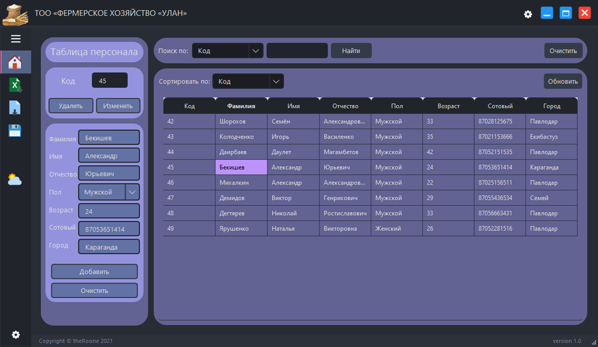

# 🌾 ТОО «Фермерское Хозяйство «УЛАН»

<div align="center">


**Десктопное приложение для управления базой данных сотрудников с интеграцией погоды**

[Возможности](#-возможности) • [Установка](#-установка) • [Использование](#-использование) • [Технологии](#-технологии)

</div>

---



## 📋 О проекте

Это дипломный проект, представляющий собой полнофункциональное десктопное приложение для управления базой данных сотрудников фермерского хозяйства. Приложение разработано с использованием современных технологий Python и Qt Framework, предоставляя интуитивный интерфейс и широкий функционал.

### ✨ Возможности

#### 📊 Управление базой данных
- ✅ Подключение к MySQL базе данных
- ✅ Добавление, редактирование и удаление записей
- ✅ Поиск и фильтрация по всем полям
- ✅ Сортировка данных по колонкам
- ✅ Валидация вводимых данных

#### 📁 Импорт/Экспорт
- ✅ Экспорт таблицы в формат XLS
- ✅ Импорт данных из XLS файлов
- ✅ Автоматическая структура папок для экспорта
- ✅ Метки времени для всех экспортированных файлов

#### 🌤️ Интеграция погоды
- ✅ Отображение текущей погоды
- ✅ Автоматическое определение города по IP
- ✅ Ручной ввод города
- ✅ Детальная информация: температура, влажность, видимость, ветер
- ✅ Время рассвета и заката

#### 🎨 Настройки интерфейса
- ✅ Темная и светлая темы оформления
- ✅ Кастомизированный заголовок окна
- ✅ Адаптивный дизайн
- ✅ Анимация переходов

## 🚀 Установка

### Требования

- Python 3.9 или выше
- MySQL сервер
- Windows, Linux или macOS

### Шаг 1: Клонирование репозитория

```bash
git clone https://github.com/your-username/dyp_work.git
cd dyp_work
```

### Шаг 2: Установка зависимостей

```bash
pip install -r requirements.txt
```

### Шаг 3: Настройка базы данных

1. Создайте базу данных MySQL:
```sql
CREATE DATABASE your_database CHARACTER SET utf8mb4 COLLATE utf8mb4_unicode_ci;
```

2. Скопируйте файл конфигурации:
```bash
cp config.ini.example config.ini
```

3. Отредактируйте `config.ini` и укажите свои данные для подключения:
```ini
[database_connect]
host = localhost
username = your_username
password = your_password
db = your_database
```

### Шаг 4: Запуск приложения

**Windows:**
```bash
python main.py
```

**macOS и Linux:**
```bash
python3 main.py
```

## 📖 Использование

### Подключение к базе данных

1. При первом запуске приложение попытается подключиться к БД с настройками из `config.ini`
2. Если подключение не удалось, перейдите в раздел "База данных" в боковом меню
3. Введите данные для подключения и нажмите "Подключить"
4. Нажмите "Сохранить конфигурацию" для сохранения настроек

### Работа с данными

#### Добавление записи
1. Заполните все поля в левой панели
2. Нажмите кнопку "Добавить"

#### Редактирование записи
1. Кликните на строку в таблице или введите ID в поле "Код"
2. Измените необходимые данные
3. Нажмите кнопку "Изменить"

#### Удаление записи
1. Выберите запись из таблицы или введите ID
2. Нажмите кнопку "Удалить"
3. Подтвердите действие

#### Поиск
1. Выберите поле для поиска из выпадающего списка
2. Введите значение для поиска
3. Нажмите кнопку "Найти"

### Экспорт/Импорт

#### Экспорт
1. Нажмите кнопку "Экспорт" в верхней панели
2. Файл будет сохранен в папку `export/[имя_базы]/`

#### Импорт
1. Нажмите кнопку "Импорт" в верхней панели
2. Выберите XLS файл, ранее экспортированный приложением
3. Просмотрите данные и нажмите "Сохранить" для записи в БД

### Просмотр погоды

1. Перейдите в раздел "Погода"
2. Выберите "По IP" для автоматического определения или "Вручную" для ввода города
3. Нажмите "Обновить"

## 🛠️ Технологии

- **[Python](https://www.python.org/)** - Основной язык программирования
- **[PySide6](https://doc.qt.io/qtforpython/)** - GUI фреймворк (Qt for Python)
- **[PyMySQL](https://github.com/PyMySQL/PyMySQL)** - MySQL клиент для Python
- **[xlwt](https://xlwt.readthedocs.io/)** - Библиотека для записи XLS файлов
- **[xlrd](https://xlrd.readthedocs.io/)** - Библиотека для чтения XLS файлов
- **[requests](https://requests.readthedocs.io/)** - HTTP библиотека для API запросов
- **[OpenWeatherMap API](https://openweathermap.org/api)** - API для получения данных о погоде

## 📂 Структура проекта

```
dyp_work/
├── main.py                 # Главный файл приложения
├── main.ui                 # UI файл Qt Designer
├── config.ini             # Конфигурация (не в git)
├── config.ini.example     # Пример конфигурации
├── requirements.txt       # Зависимости Python
├── setup.py              # Файл для сборки приложения
├── modules/              # Модули приложения
│   ├── __init__.py
│   ├── app_config.py    # Работа с конфигурацией
│   ├── app_functions.py # Функции приложения
│   ├── app_settings.py  # Настройки приложения
│   ├── ui_functions.py  # UI функции и логика
│   └── ui_main.py       # Сгенерированный UI код
├── themes/              # QSS темы оформления
│   ├── dark_theme.qss
│   └── light_theme.qss
├── images/              # Изображения и иконки
└── resources.qrc        # Qt ресурсы
```

## 🔧 Компиляция в исполняемый файл

Для создания standalone приложения используйте cx_Freeze:

```bash
python setup.py build
```

Исполняемый файл будет находиться в папке `build/`.

## ⚙️ Переменные окружения

Вы можете использовать переменные окружения для дополнительной настройки:

- `OPENWEATHER_API_KEY` - Ваш API ключ OpenWeatherMap (опционально)

## 🤝 Вклад в проект

Этот проект был создан в качестве дипломной работы. Если вы хотите внести улучшения:

1. Форкните репозиторий
2. Создайте ветку для новой функции (`git checkout -b feature/AmazingFeature`)
3. Закоммитьте изменения (`git commit -m 'Add some AmazingFeature'`)
4. Запушьте в ветку (`git push origin feature/AmazingFeature`)
5. Откройте Pull Request

## 📝 Лицензия

Этот проект распространяется под лицензией MIT. Подробнее см. файл [LICENSE](LICENSE).

## 👨‍💻 Автор

**theRoone**

- GitHub: [@your-username](https://github.com/your-username)

## 🙏 Благодарности

- Qt Framework за превосходный GUI фреймворк
- OpenWeatherMap за бесплатный API погоды
- Всем контрибьюторам открытых библиотек, использованных в проекте

---

<div align="center">

**Если этот проект был полезен, поставьте ⭐️**

</div>
